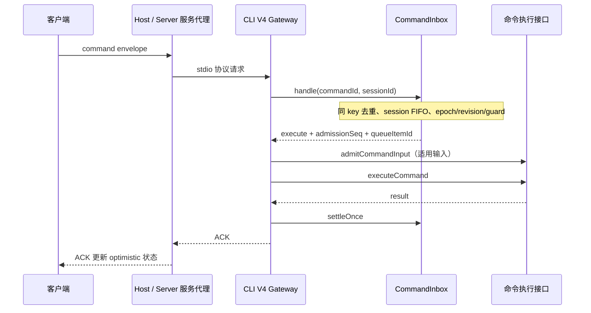
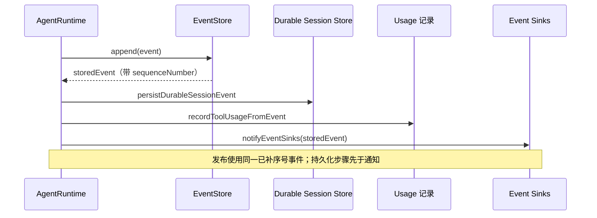

# ZCode 架构分析

基于提交 `29628c9acdb81b703bbd4080c207a0e7ce5e276e`，项目版本 `3.14.3`。分析日期：2026-10-03（Asia/Shanghai）。开始时工作区干净，freshness 检查通过，main 与 origin/main 同步。本次仅新增分析产物，未修改应用行为。

[打开交互架构图](zcode.html)。图中节点提供固定提交的源码链接，支持主题切换与图形导出。图是运行角色总览；不同部署复用 Runtime 实现，拥有各自进程实例，图中的汇合箭头不表示桌面与独立 Web 共用同一个 Agent。

## 项目形态与主链路

ZCode 是由共享 React UI、服务契约与 RPC、平台入口、Agent CLI/runtime 组成的多端 AI 编程工作台。桌面进程隔离、远端工作区身份和会话命令时序，是理解这个项目的三个关键边界。

| 入口 | 调用链 | 关键约束 |
| --- | --- | --- |
| Desktop | Renderer → MessagePort RPC → 窗口 Host 的 services → stdio → Agent | 每个窗口一个 Host；本地 workspace 共享该窗口 Host |
| 独立 Web | 浏览器 → WebSocket `/ws` → HTTP Server 的 services → stdio → Agent | 使用 replayable 语义；普通 Web 入口关闭远程工作区 UI |
| Desktop 远端 | Renderer → 同一窗口 Host 的连接注册表 → 远端 zcode-server → 远端 services/Agent | logical session、attachment 与实际 transport 分离，带 workspaceIdentity 和 remoteSessionId |
| CLI/TUI | 终端入口 → CLI/runtime | 属于仓库提供的另一入口，主图未展开终端渲染细节 |

桌面和 Web 都给共享 `Root` 注入 services 与 platform。组件通过 React Context/hook 获取服务；`packages/client` 将 RPC channel 包装成服务代理。平台差异由 `IPlatformService` 与入口装配承担。

依据：[Desktop 入口](../../packages/desktop/src/renderer/src/main.tsx#L303)、[Web 入口](../../packages/web/src/main.tsx#L438)、[服务 Context](../../packages/ui/src/hooks/useServices.tsx#L9)、[独立 Server 装配](../../packages/server/src/entry-http.ts#L17)、[远端连接](../../packages/desktop/src/host/index.ts#L1652)。CLI/TUI 能力依据根目录 README 的现有运行说明，未进一步审计其终端交互实现。

## 状态所有者与通信边界

| 状态/行为 | 当前源码中的所有者 | 对分析的意义 |
| --- | --- | --- |
| UI 草稿、optimistic overlay、界面状态 | `packages/ui` 的 Zustand store 与 UI 状态 | 不应反向充当已执行命令或持久化会话的事实源 |
| 窗口、原生能力、Host 进程启动 | Electron Main | `utilityProcess.fork` 拉起 Host；不直接执行会话核心逻辑 |
| 跨 Host run lease、命令路由、流批次 replay | Main 的 `TaskRealtimeBus` | Main 也有协调状态，不能概括成“完全无状态转发” |
| 远端 transport、logical session、attachment 生命周期 | 窗口 Host 的注册表 | 连接失效时按 remoteSessionId 清理 attachment，防止旧连接继续持有 facade |
| 服务组合、Session facade、task wrapper、任务索引 | `packages/services`，由 Host/Server 装配 | 包含产品业务与索引投影；核心 session 执行事实由 Agent server/runtime 维护 |
| commandId 去重、每会话串行 admission | CLI `CommandInbox` | 已接纳 busy/running 输入的顺序由 CLI 决定 |
| 会话运行、模型/工具调度、事件产生 | `AgentRuntime` | 通过端口注入执行、文件、模型、MCP 等能力 |
| 会话、消息与部件的持久化 | CLI 的 SQLite session store 适配器 | 真实写入点位于 adapters 的 repository 调用，不能画成 UI 直接写库 |

`TaskRealtimeBus` 在 Main 保存 lease、stream batch、pending route，并实际裁决 ownerHostId/runId。它也保存有界传输 replay，并向观察者发 snapshot invalidation。这些是当前实现事实，不应因“Main 薄转发”的原则而省略；它们也不等于 Runtime 的持久化会话队列。后续修改需区分两种 replay 机制。

依据：[Main fork](../../packages/desktop/src/main/desktopHostProcess.ts#L257)、[Main 协调状态](../../packages/desktop/src/main/taskRealtimeBus.ts#L122)、[lease 裁决](../../packages/desktop/src/main/taskRealtimeBus.ts#L317)、[传输 replay](../../packages/desktop/src/main/taskRealtimeBus.ts#L490)、[远端失效清理](../../packages/desktop/src/host/index.ts#L1760)、[Session/task 装配](../../packages/services/src/node.ts#L2301)、[CommandInbox](../../apps/zcode-cli/packages/bootstrap/src/zcode-protocol-v4/command-inbox.ts#L117)、[SQLite 写入](../../apps/zcode-cli/packages/adapters/src/storage/session-store/sqlite-session-store.ts#L609)。

## 命令与事件顺序

下面是两条源码已确认的顺序链。命令 ACK 的 accepted 表示命令接纳/处理结果，不代表模型整轮执行完成。

依据：[Gateway admission/execution/settle](../../apps/zcode-cli/packages/bootstrap/src/zcode-protocol-v4/v4-gateway.ts#L2398)、[FIFO 与去重](../../apps/zcode-cli/packages/bootstrap/src/zcode-protocol-v4/command-inbox.ts#L129)、[事件真实写入/通知顺序](../../apps/zcode-cli/packages/core/src/runtime/methods/events.ts#L101)。图不规定 ACK 与后续模型事件之间的全局相对顺序。

## 已确认的设计优点

1. **平台入口与共享 UI 复用。** Desktop/Web 对同一 Root 注入平台和服务，适合共用交互，同时按平台裁剪能力。
2. **连接能力有显式信任边界。** 普通 `/ws` 固定为 terminal-client/replayable；`/ws/host` 消费有效 host capability 才提供 trusted-host 路径，不能通过旧 mode header 自行提权。
3. **命令接纳集中。** CommandInbox 使用 key gate 与 session gate，并区分 in-flight、live input、settled，避免执行中的命令因 settled LRU 淘汰后被重试重复执行。
4. **事件顺序统一。** 先 append 补序号，再持久化、记录 usage、通知 sink，减少 live/replay 顺序事实分叉。
5. **身份与文件路径区分。** 工作区进程按 identity/path key 管理；spawn 的 cwd 使用真实路径，远端 identity 用共享构造/解析工具。

依据：[clientMode 能力映射](../../packages/services/src/zcode-agent/zcodeAgentConnectionScope.ts#L201)、[HTTP 信任门](../../packages/server/src/http.ts#L323)、[命令 pin/FIFO](../../apps/zcode-cli/packages/bootstrap/src/zcode-protocol-v4/command-inbox.ts#L139)、[spawn 隔离](../../packages/services/src/zcode-agent/zcodeAgentProcessManager.ts#L1019)、[identity 工具](../../packages/shared/src/remote-workspace-identity.ts#L42)。

## 维护关注点与建议

以下是静态分析得到的维护风险，未通过运行时复现确认成 bug；本次没有实施重构。

| 优先级 | 已确认现状 | 影响判断与建议 |
| --- | --- | --- |
| 高 | `architecture-policy.yaml` 开启 `managedOnly: true`，只有 storage 标记 managed | 核心 Host/session/CLI 等尚未纳入同等强度的治理范围。建议先定义公开契约和基线，再逐模块扩大治理，避免直接全仓开启造成噪声 |
| 高 | 多个装配/路由文件很大：services/node 2810 行、AgentService 5664 行、Host index 2969 行、V4 Gateway 3454 行 | 职责集中增加变更阅读成本。建议按清晰的装配、连接生命周期、命令接纳、会话投影边界拆分；保持唯一状态写入点与实际事件顺序 |
| 中 | policy 的 session publicEntrypoint 指向不存在的 `packages/services/src/session/contract.ts` | 策略与检出源码存在引用漂移。建议确认真实公开入口后修正策略；目前检查未能运行，不能声称该路径已产生某种具体诊断 |
| 中 | Web Root 设置 `allowRemoteWorkspace=false`；同文件 TODO 指出远端 WebSocket 服务集合与 accessor 不匹配 | 产品能力应明确区分“Server 能连远端”和“普通 Web UI 已支持远端”。建议若推进支持，先补 spec 与完整服务契约，再补交互 E2E |
| 中 | Main 有跨 Host lease/传输 replay，CLI 有命令 inbox 与 durable 会话事实 | 修改 stream/reconnect 时要同时检查 owner/runId、Host generation、clientMode；传输 replay 不能替代 CLI 接纳或持久化 |

依据：[架构策略](../../architecture-policy.yaml)、[Web 限制与 TODO](../../packages/web/src/main.tsx#L206)、[Web Root 开关](../../packages/web/src/main.tsx#L468)。文件行数来自本次检出的源码计数，是规模信号，不是违规或缺陷判定。

## 未确认范围

Host 源码说明 Renderer/手机可 attachment 到同一窗口 Host，且实际暴露接口接受两种 clientMode。但本次未确认外部手机 relay 的部署、鉴权配对与重连全链路，主图没有凭空添加 relay 服务。也没有启动 Desktop/Web/远端进程，未验证手机闭环、远端兼容性、性能或资源占用。插件、自动化、CUA、动态工作流只保留扩展角色，未对每个功能独立审计。

## 验证与产物

| 检查 | 结果 |
| --- | --- |
| `node scripts/check-workspace-freshness.mjs` | 通过：与 origin/main 同步 |
| `pnpm typecheck`（由 `corepack pnpm` 调用） | 失败：node_modules 缺失，tsc 不可用 |
| `pnpm lint`（由 `corepack pnpm` 调用） | 失败：node_modules 缺失，oxlint 不可用 |
| `pnpm architecture:check --changed`（由 corepack 调用） | 失败：缺失 typescript，检查器无法加载 |
| Archify `finalize --quality showcase --repo-root` | validate、deliver、strict check、真实浏览器检查均通过，零诊断 |
| Archify screenshots | 对最终 HTML 另行采集并复核浅色/深色桌面截图；状态见 `visual-review.md` |

终端默认 Node 为 24.21.0，仓库 mise.toml 固定 24.14.0；本次未声称执行了固定版本下的工程验证。未安装整个工程依赖，仅调用已存在的 Corepack 与 Archify 工具。

- [可编辑图规格](candidate.json)
- [最终检查回执](review-3/zcode.finalize-summary.json)
- [HTML 交付与 SHA-256 回执](zcode.delivery.json)
- [视觉复核记录](visual-review.md)

Archify 检查证明图规格、固定提交源码引用范围、产物来源与浏览器视口检查通过；不代表项目 typecheck、lint 或功能 E2E 通过。
