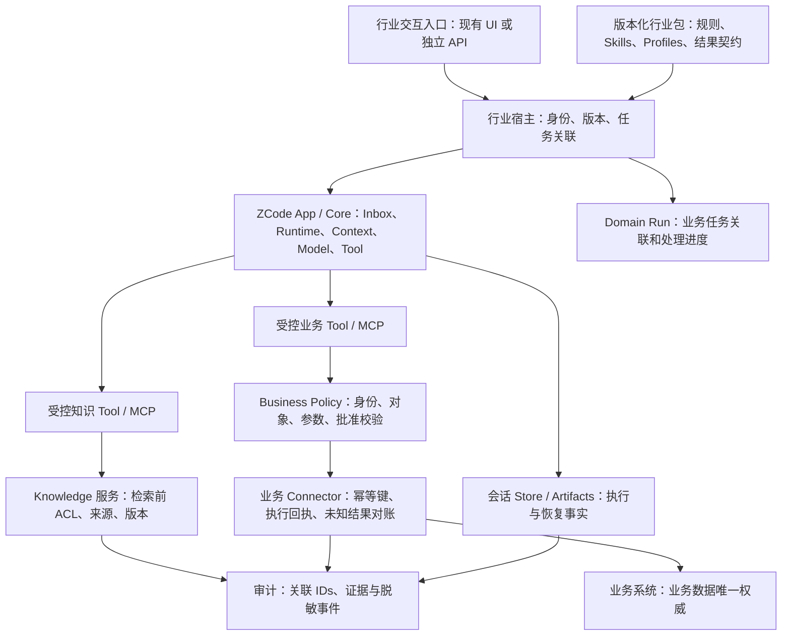
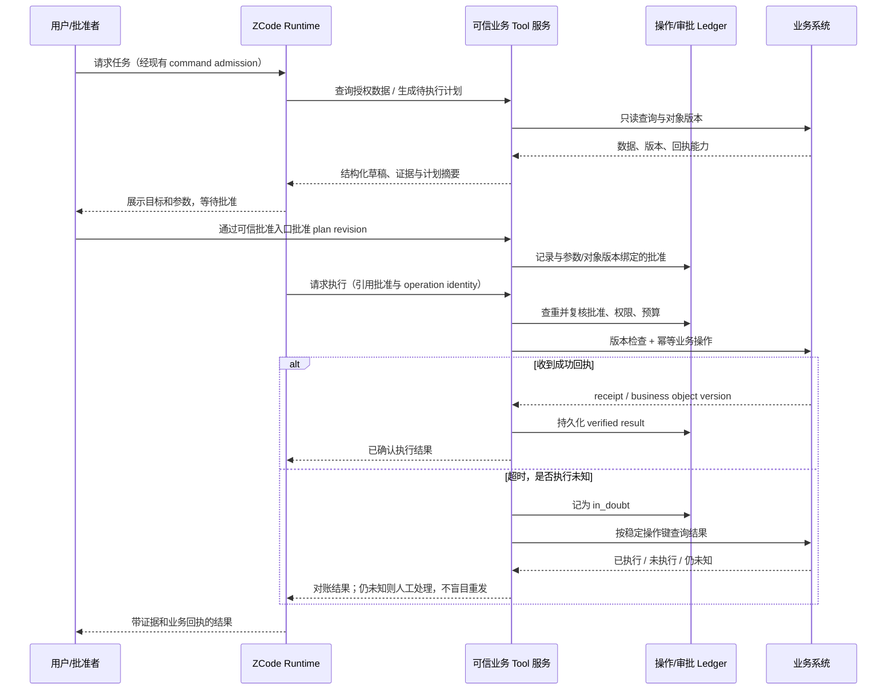

# 行业 Agent：建议目标设计

本文件是建议方案，**所有“行业包、Knowledge、Business Policy、Operation Ledger、Domain Run”等新增概念都不是当前仓库已经实现的接口或模块**。当前能力和源码证据见 [评估](agent-base-assessment.md)，先确定产品需求和 spec 后才实施。

## 1. 分层与依赖

建议保持 ZCode 执行核，增加窄的行业宿主和业务能力，不把领域规则塞入 Main、Renderer 或通用 Model adapter。

这张图表示建议职责和调用路径，不代表当前已有上述部署拓扑。Tool/MCP 与业务系统之间的策略和 connector 可以先由同一个有清晰契约的行业服务承担，验证后再按负载拆分，避免为了分层立即引入多服务。

领域规则层保持纯规则；应用层决定副作用；adapter 执行 IO。业务系统 client 不进入 Renderer，通用 Runtime 不直接 import ERP/CRM 实现。新跨包接口从公开入口导出；注册新模块时按当前 `architecture-policy.yaml` 和 module contract 规范实施。

## 2. 行业扩展包的边界

第一版用现有 plugin/Skill/profile/MCP 能力组织交付。若增加独立的行业包 manifest，以下是**拟定信息模型，不能直接当作现有插件 manifest 格式使用**。

| 信息 | 作用 | 约束 |
|---|---|---|
| packageId / version / digest | 确定发布物 | 由可信安装/发布端验签或核验；不由用户 Prompt 指定任意路径 |
| taskTypes / entry profiles | 明确可承接任务 | “质检调查”应有明确输入、产物和结束标准 |
| prompt / Skills / profiles | 行业术语、步骤、角色分工 | 指令指导行为，不能授予权限或自动批准操作 |
| input / output schema versions | 机器可校验契约 | schema 通过不等于结果事实正确；还需领域规则与证据校验 |
| approved tools / server bindings | 稳定能力映射 | server/tool 身份由可信配置确认，不能信任外部 descriptor 的风险自报 |
| knowledge collections / evidence requirements | 明确知识范围 | collection 列表还要交叉用户权限与有效期 |
| business policy version / action classes | 哪些操作需审批和约束 | tool 参数不能自行设置 tenant、principal 或批准结果 |
| evaluation set / expected assertions | 验证具体业务价值 | 和真实数据分离；发布前固定集回归 |

tenant/principal、凭据和批准权不属于模型可自由编辑的包内容。正在执行的 Domain Run 固定相关版本；模型 endpoint/能力与 per-attempt auth 的现有分离规则继续保留。升级包不热改已批准计划，确需重规划时产生新 plan revision。

## 3. 状态所有者与 ID

| 状态 | 唯一权威 / 建议 owner | 其他层如何使用 |
|---|---|---|
| 用户身份、组织、权限 | 身份/业务授权服务 | Host 传可信 principal；Tool 不能用用户文本替代 |
| workspace 路由与 IO 目标 | 现有 Host registry / Runtime context | identity 用于隔离，path 用于 IO；保留 remoteSessionId |
| 已接纳 conversation input | 现有 CLI CommandInbox / input ledger | UI draft/pending、Domain Run 关联记录都不建立第二份 accepted prompt queue |
| turn、tool execution、history | 现有 Session Runtime / SessionStore | UI 与业务宿主读投影或事件；不写同一事实的影子状态 |
| dynamic workflow engine run | 现有 workflow engine / journal | Domain Run 记录关联 runId，不重复其调度和恢复事实 |
| 行业任务关联与处理进度 | 建议 Domain Run 应用服务 | 关联 caseId、sessionId/workflowRunId、版本、证据和操作；不把 Runtime running 直接当业务处理中 |
| 源业务对象及最终效果 | 原业务系统 | Domain Run 保存观察/回执引用，不能因模型声称成功改业务对象 |
| 操作请求、审批、对账记录 | 建议 operation/approval 服务 | connector 查 ledger，但最终是否落地还需业务系统回执或状态核对 |
| 文档及证据版本/ACL | 源系统 + Knowledge 服务 | 缓存和检索是派生视图；权限变更要使缓存失效 |
| 交互局部状态 | 现有 UI store | 草稿、选择、pending overlay；不承载业务审批权威 |

建议分别关联 `tenantId / principalId / caseId / domainRunId / sessionId / commandId / turnId / workflowRunId / operationId / evidenceId`，不要求把全部字段塞进现有每条协议消息。哪个字段跨哪些边界，应由对应 spec 定义严格类型与 runtime 校验。

`workspaceIdentity?.trim() || workspacePath` 仍用于 ZCode workspace key，不能直接替代 tenant/user ACL。新租户身份通过可信宿主建立显式映射；不在业务代码中手写现有 remote identity 格式，也不绕过 owner/lease 与 stale run guards。

## 4. 知识与 Memory

行业知识至少分三类：可版本化的规程/产品资料、带授权的实时业务记录、个人或任务经验记忆。三者不能一起无差别注入 Prompt。

建议先通过 MCP 或窄 Tool 实现 `search / fetch evidence` 的语义，不先新增一个通用 RAG 引擎。检索请求中的数据范围来自可信身份和 case scope；业务 ACL 必须在返回文档片段前生效。返回 evidenceId、源对象/文档 ID、版本、有效期、定位、摘录和数据级别；评分只代表相关性，不代表真实性。

Evidence Store 保存最终引用所需的固定证据或受控版本引用。完整对话和摘要不是证据库存档；compact 后仍能按 evidenceId 复核出处。检索缓存 key 需要包含租户、权限范围/修订、文档版本和查询参数，不能只用 workspacePath。

现有 memory extraction 可复用来记录偏好和经验，但应为行业使用定义 scope、来源、纠错、有效期和删除规则。第一版敏感场景可关闭自动 extraction，保留显式授权记忆；若启用，需要证明其写入范围、权限和数据保留符合目标需求。源业务事实和规范生效版本不由模型 memory 覆盖。

## 5. 工具、审批与副作用

建议将行业工具分为“授权只读”“生成草稿”“受控写入”三类，每个工具有明确输入/输出、对象范围、风险、超时、幂等与不确定结果语义。复用 Core 的 schema/permission/hooks/serialization，业务规则另在可信工具服务执行。

保留现有本地 Tool 与 MCP 的统一执行链。选用 MCP 是适配方式，不代表自动获得企业授权；代理服务不得无校验透传不属于它的 token，应明确 token audience 和授权范围。该原则来自 [MCP 官方安全建议](https://modelcontextprotocol.io/docs/2026-07-28/tutorials/security/security_best_practices)，并非本次已确认 ZCode 存在该漏洞。

业务批准建议绑定：可信批准者、tenant、case、目标对象、操作类型、canonical 参数摘要、对象版本、policy/plan revision、有效期。普通工具允许执行与某项业务获批是两个检查；Hook 可以协助提醒/阻断，但不能单独充当企业授权权威。

这是建议事件顺序。批准入口可以集成现有 UI/交互能力，但 UI 不直接写数据库或业务系统。高风险操作必须在实际执行前再次检查权限与对象版本；批准后对象或参数变化时旧批准无效。

业务幂等键由可信服务按 tenant、case/run、逻辑步骤、目标、操作类型和计划 revision 建立，并同时保存参数 fingerprint。不能仅用 toolCallId：模型或恢复可能生成新的 toolCallId，却表达同一操作。相同操作键的参数不一致必须拒绝，而不是当 duplicate 成功。

如果下游不支持幂等写入或查询稳定操作回执，ledger 自身无法证明 exactly-once。应定义补偿或人工对账；在高风险场景中，证据不足时维持草稿/待核验，不开启无人值守写入。retry model、retry tool 和 retry business operation 不共享默认策略。

## 6. 本地试点与云部署

本地/内部试点优先复用现有 UI、Host、CLI session、扩展和存储。工具曝光遵守场景最小能力；非 coding 场景先关闭不需要的 Bash/文件写入/浏览器能力，并在实际 adapter/业务服务端落实限制。

共享云部署需要可信控制面和受控执行 worker：tenant-bound 凭据、独立存储/临时目录/资源配额、网络和文件边界、可取消任务、lease/fencing 和结果对账。现有 process/Host 路由只能作为参考，不能据此声明已经支持集群 job scheduler。

不能只传空 ExecutionPort 或切换 sandbox boolean：Bootstrap 缺省会装配 Node adapter。若共享宿主上执行不可信任务，应显式注入有拒绝/约束语义的端口，并配置 OS 隔离及出站边界，验证工具注册和实际执行一致。`skipUserConfig` 也不自动隔离用户 home 下的 Skills、插件、memory 与文件访问；这些根、凭据和工作目录需要逐项审计。

继续保留 desktop-continuous 与 web-remote-replayable 的差异。手机访问既有 Host attachment，不能为手机再启动行业 Agent。若增加独立行业 API，则明确它的新连接、授权和交付契约，不能冒充 Desktop attachment 的既有语义。

## 7. 结果与观测

建议行业结果包含任务范围、已核实事实、规则检查、证据引用、待解决问题、草稿/执行状态、业务回执和人工交接项。schema 可校验结构，领域校验器验证一致性；引用必须能定位到本次有权限的证据，不接受凭空 evidenceId。

已有 event/trace/usage 用于关联 execution；补充 domainRunId/operationId 与批准/证据版本，区分 model attempt、stream recovery、tool result、业务提交。审计不要收集模型未公开的内部推理，默认不记录凭据或全部敏感原文，保留所需的授权证据和受控内容引用。

若对接 OpenTelemetry，可集中映射已有事件到标准 spans/metrics，避免各行业包各自命名。GenAI agent conventions 当前仍为 Development，应固定兼容版本，不能假定属性已经稳定。参见 [OpenTelemetry 官方 Agent spans 文档](https://github.com/open-telemetry/semantic-conventions-genai/blob/main/docs/gen-ai/gen-ai-agent-spans.md)。这不是要求本次新增观测依赖。

## 8. 示例闭环与边界

制造质量调查示例：用户选择一个有权访问的批次 → 创建 case 关联和 Runtime session → 只读工具获取检验记录/规程 → 缺失项和证据来源由规则校验 → Agent 生成结构化摘要/工单草稿 → 用户审查。后续受控写入版本才增加批准与提交链。

“候选原因”与“已确认事实”必须分开；没有数据不能生成合格结论。聊天已答复、workflow actor 已 submit 和业务工单已创建是三种完成事实，分别由 Runtime、workflow engine、业务系统确认。Domain Run 依据这些事实推进，不在模型回答中寻找字符串决定任务成功。
